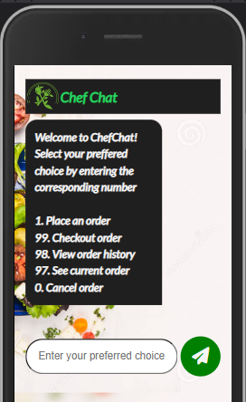

<!-- ABOUT THE PROJECT -->

# A Chatbot for a restaurant

This is a mini chat bot application created using Node.js, ExpressJs and Socket.io. This chat bot allows bidirectional communication between the client and the server.

---

[![Contributors][contributors-shield]][contributors-url]
[![Forks][forks-shield]][forks-url]
[![Stargazers][stars-shield]][stars-url]
[![Issues][issues-shield]][issues-url]
[](https://www.linkedin.com/in/enyinna-chinwendu-promise/)
[](https://twitter.com/_ChinwenduE)
[![AltSchool Badge](https://img.shields.io/badge/-Engineering-6773E5?style=for-the-badge&logo=data:image/png;base64,iVBORw0KGgoAAAANSUhEUgAAAIcAAACHCAYAAAA850oKAAAACXBIWXMAACE4AAAhOAFFljFgAAAAAXNSR0IArs4c6QAAAARnQU1BAACxjwv8YQUAAAcmSURBVHgB7d3/kZtGFAfwbzL5P0oF2VRwlwq8qcBKBUcqsFyBSAW5VGBcgS8ViFRwdgW3qeDcgaM3wBy3egu7sBLY9/3MMD6h5QnBg/0ByAARERERERERERERERERERERERERERERERERERERERERERERERFdwHc4DxtR5uNx+hxRbnOcriOWjS1HC7LH6UvEVETGK5RlzYxyFOl75Fco894r816BVu0cyaHt9Fucnt63aKoCWqncyWFxeir/F03d/483X2sj0IrkTo5CmVd5//bdgFYrd3JoVUrd/qv1HFi1rNgPyEeqCOPNkyrFtX9LYkjV0j9bdFVLjWlk+V3795Xy/g5PCVn11oUuTBqdY91Vq5R5NxK3QLiLahDXbf6CuLEX6slZrQxVKR1WLV+RXMlhoI9OOm9eV7X0sdeyUrmSY6vMex8oWynzpvZaHJpLAH+gScb6OP19nH5p5/enGrSIA+KHruVM8eiVfUS4aikiY/ttnj1ocQanO+9+ZJkK8Q3GAtOvrbAtM0OOasUq896PLFMp86ZWLUOYHDPkGOfQdqqc0t8gjbRb3oKX2FdjbnIY6GeODdKP2rkDYpTZ3GrFIq8taDXmJkfudsI52h000ZxqRaoB681zx+k3xJPu52slZg1a3Jzk0KqAGmkXt/zk6OLWuIyXOHTvcIHte4f5F7dCA2J9BaaPc4xVUw7xF+6+lekdIs1pc7zyXjukZ2ToWotFOq0LXB2nh3bi9ZtEU5NDOx3XmKYKxE9VQ08Q004cEEs0Jzl8Y6OiIdpl/BukkxhvQdlMTQ6/Eekw/cyRs2qpjtPv4B1fWUx94s0o8xym00ZUP7eT9p5DeswuXp/By6NtByIiIiIiIqJvwbl+2ecaT9cyZKxB+tUO/KWdr0rO5LBo7huVf4euY9RohtorXNbBe73EOixBrsKa3mt5frnEhWzaFUi9dPyAy45Q+p9f4mVwWOCSvZDEkGdUCqQz7bK8lL5Sc+8+lzu5jDJf2hWf0LQx0Ja5UspKcn04Tr+CbZFvioFeXUjChNocZWCZEufHaiWxWpmjxLQNXkBvf5wbkyMxOeZUK0aZd4dxFZqbeawXSyY3suw1nveGpCrqnq6fy7bxN72YqVVd92BWF0c4pN947ce0eN42+wj9Jy5WowIm32C8Q7PB+pMZKG+hP8nfP/OMPX4ZOnN07R4t5h5xNm3Zx4F1lPVPaXwbNNt4LKYZieOwQLWyg76yue/V3CNP9ziUHB8w727t6/ZzY9dxj3FbDCdFSkyX+H2ysAjvoAJ5uqh7xG+g/udrCaolRxEZcxdYP4O0ndhNfyFsOyHeUII4LJAc4oDhFZYNJ0embFyLNEUgZo1mx5bt31qZgxJPS477NkbRTjLvIfA9/ITbDJSteuv4gPiEMwMxb9t4twMxrRLTYaHkMEg/ciRZiojY2gYolXI7xG0o//0qEM8EPtu/434P/axllJgl4hKuUsrdQz8Tlog7KBwWSg5hkFbnjm1IUSjlh75UqZS/9cpoSRqiJVzplXlI+D7A+E9xbpC2jcQB4weFw4LJ0ZENOiVJbpRYd0q5oTZM1/10van2yqQkm8FwctjEeN06Pg4so7U1ipGYFuMHhcMKkqNj0SSK7ODYKsd6Me5xegTNNbSzU8trZ5aYBvgB4e9VKjFNREznLXM38n50cpzjv9So0WSvHAk/obluIj8FKZfIXWCZvffa39D/YV20NsBHjPvkvTaBv8VnxA1y+Z97hUzOkRw+WfkKzSlSfh/0T6WMxcu4Opsy4hpbNnUUN9rU4XOD0/qwRtwwdonmyPNHNC3CR9+PWBdth2wwvqOuI+L048X4OSFmkqnJ0Q0X+/NqxJFyb5TlO1KN9L+0wbpoO0B2fI1h/o7sVzNyYNz0XnfXVGoMO1sVPLVaCT0Zn2vo3G9UdRsqRGvp1zifO2XefmQZC/334bW/O68xrMDpNr/DCkij098hHyKWC40s2l4ZC73Pv0mIV3jlcvZWxAFx3fKhdfST5R7jPbmOCcQ0XjmHBbqyBnq3VFbYBpaR+feBZXyHQLnrifFyJ4eF/v33eL6DLPSdqO2kIiKmJNo2IaaLKHMWO+hfRiYZ4zi0KyNnlIeBslsl9jXC4ySPGB5DKZR4uZND3GL4+4fek21hAp97yBzTYaHkECXCKxwz7QZiFxPilYFY50gOUSFt/WQHj4323ifGfEA42RwWTA5RIH3oXMrbiNgmMrZs9O1AnHMlBxB/gNSI73ndZorpMDE5cj7UZPA0dB4apZMejnTfSqT3Jgo0O/8Vnt8mKPGkhV5huI9fea/vMNyyTy1v2nW0eP5Li9K1rNt4NdIYPN3ucOXF7NanHokhSdZvyNeIfJgrZ3L0dfdSbnD6OCQRERERERERERERERERERERERERERERERERERERERERERERERERERERncX/Z96oxRsCt/4AAAAASUVORK5CYII=&logoColor=white&link=https://altschoolafrica.com/schools/engineering)](https://altschoolafrica.com/schools/engineering)

<!-- PROJECT LOGO -->
<br />
<div align="center">
<div align="center">

</div>

  <p align="center">
    <!-- <br />
    <a href="https://github.com/wendeee/blog_API/blob/main/README.md"><strong>Explore the docs »</strong></a>
    <br /> -->
    <br />
    <b><a href="https://chefchat.onrender.com/">View Demo</a></b>
  </p>
</div>

# Technologies used

<div align="center">


<!-- 
 -->

</div>

---

<!-- Project Requirements -->

# Requirements

<details>

<summary>The following are the requirements for this project 👇:</summary>

- [x] ChatBot interface should be like a chat interface.

- [x] When a customer lands on the chatbot page, the bot should send these options to the customer:

  - [x] Select 1 to Place an order

  - [x] Select 99 to checkout order

  - [x] Select 98 to see order history

  - [x] Select 97 to see current order

  - [x] Select 0 to cancel order

- [x] When a customer selects “1”, the bot should return a list of items from the restaurant.The order items can have multiple options but the customer should be able to select the preferred items from the list using this same number select system and place an order.

- [x] When a customer selects “99” out an order, the bot should respond with “order placed” and if none the bot should respond with “No order to place”. Customer should also see an option to place a new order

- [x] When a customer selects “97”, the bot should be able to return current order

- [x] When a customer selects “0”, the bot should cancel the order if there is.

---

</details>

<br>

# Development

## Prerequisites

- Ensure you have [Node.js](https://nodejs.org/en/download/) installed on your local machine.

### Clone this repo

```sh
 git clone https://github.com/wendeee/Chef-Chat.git
```

### Install project dependencies

```sh
npm install
```

### Update .env with [example.env](https://github.com/wendeee/Chef-Chat/blob/main/example.env)


### Run development server

```sh
npm run dev
```


## Lessons I learned while working on this:

- Learned how to use socket.io to create applications that allows bidirectional communication.

<!-- CONTACT -->

## Contact

- Twitter - [@\_ChinwenduE](https://twitter.com/_ChinwenduE)

Project Link: [https://github.com/wendeee/Chef-Chat](https://github.com/wendeee/Chef-Chat)

<!-- MARKDOWN LINKS & IMAGES -->
<!-- https://www.markdownguide.org/basic-syntax/#reference-style-links -->

[contributors-shield]: https://img.shields.io/github/contributors/wendeee/Chef-Chat.svg?style=for-the-badge
[contributors-url]: https://github.com/wendeee/Chef-Chat/graphs/contributors
[forks-shield]: https://img.shields.io/github/forks/wendeee/Chef-Chat.svg?style=for-the-badge
[forks-url]: https://github.com/wendeee/Chef-Chat/network/members
[stars-shield]: https://img.shields.io/github/stars/wendeee/Chef-Chat.svg?style=for-the-badge
[stars-url]: https://github.com/wendeee/Chef-Chat/stargazers
[issues-shield]: https://img.shields.io/github/issues/wendeee/Chef-Chat.svg?style=for-the-badge
[issues-url]: https://github.com/wendeee/Chef-Chat/issues
[license-shield]: https://img.shields.io/github/license/wendeee/Chef-Chat.svg?style=for-the-badge
[license-url]: https://github.com/wendeee/Chef-Chat/blob/master/LICENSE.txt
[linkedin-shield]: https://img.shields.io/badge/-LinkedIn-black.svg?style=for-the-badge&logo=linkedin&colorB=555
[linkedin-url]: https://linkedin.com/in/enyinna-chinwendu-promise
<!-- [product-screenshot]: images/screenshot.pnociag -->
[twitter-url]: https://twitter.com/_ChinwenduE
